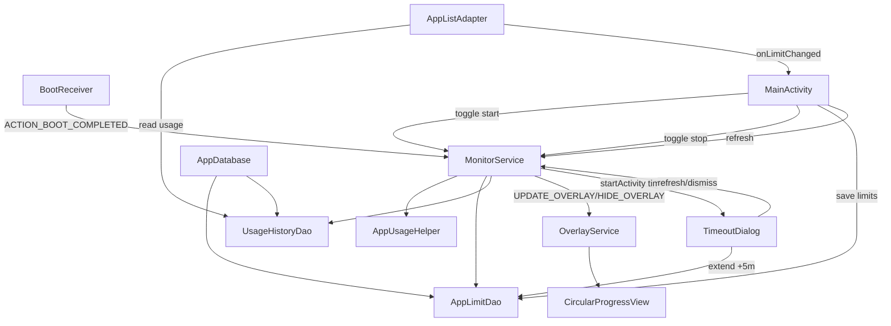

# Call Graph

This graph summarizes the main runtime call flow in the app.

## Key Paths

- Start monitoring: `MainActivity -> MonitorService.start() -> checkCurrentApp()`
- Foreground check loop: `MonitorService -> AppUsageHelper.getCurrentForegroundApp()`
- Limit hit path: `MonitorService -> TimeoutDialog`
- Overlay path: `MonitorService -> OverlayService -> CircularProgressView.startCountdown()`
- Persist usage: `MonitorService.saveCurrentSession() -> UsageHistoryDao.insertHistory()`
- Update limit after timeout: `TimeoutDialog.extendTime() -> AppLimitDao.updateLimit() -> MonitorService.refresh()`
